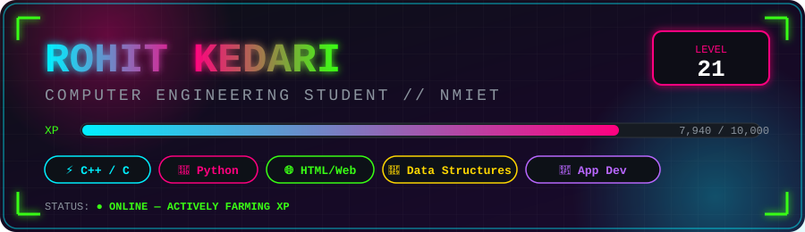
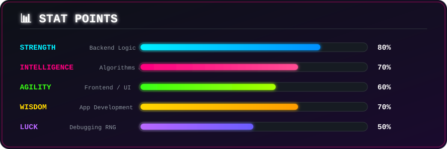

<div align="center">



<br><br>


<br><br>


</div>


## 🗺️ Quest Log

<table align="center" width="100%">
<tr>
<td width="50%" valign="top">

```diff
+ ACTIVE QUEST
  Mastering App Development
  & Web Development

! SIDE QUEST
  Sharpening Data Structures
  & Algorithms

# GUILD
  NMIET — Computer Engineering

$ CONTACT
  rohitkedari017@gmail.com
```

</td>

<td width="50%" valign="top">

**💬 Ask me about:**


**📬 Reach me:**

<a href="mailto:rohitkedari017@gmail.com">

</a>

<a href="https://linkedin.com/in/rohit-kedari">

</a>

<a href="https://discord.gg/rohit05291">

</a>

</td>
</tr>
</table>


## 📊 Character Stats

<div align="center">



</div>


## 🎒 Inventory — Tech Arsenal

<div align="center">


</div>


## 🌐 Guild Halls & Social Links

<div align="center">

<a href="https://linkedin.com/in/rohit-kedari" target="_blank">

</a>

<a href="https://leetcode.com/rohitkedari-git" target="_blank">

</a>

<a href="https://discord.gg/rohit05291" target="_blank">

</a>

<a href="mailto:rohitkedari017@gmail.com">

</a>

</div>


## 📈 Daily Grind — Contribution Activity

<div align="center">


</div>


## 🏆 Trophy Room

<div align="center">


</div>


## 🎮 Player Dashboard

<div align="center">


<br><br>


</div>

<br>

<div align="center">

### 💾 *"Every commit is XP. Every bug is a boss fight. Every merge is a level up."*

<br>


</div>

## 🐍 Contribution Snake

<picture>
  <source
    media="(prefers-color-scheme: dark)"
    srcset="https://raw.githubusercontent.com/Rohitkedari-git/cyber-contribution-snake/output/cyber-snake-dark.svg">

  <source
    media="(prefers-color-scheme: light)"
    srcset="https://raw.githubusercontent.com/Rohitkedari-git/cyber-contribution-snake/output/cyber-snake-light.svg">

  
</picture>
